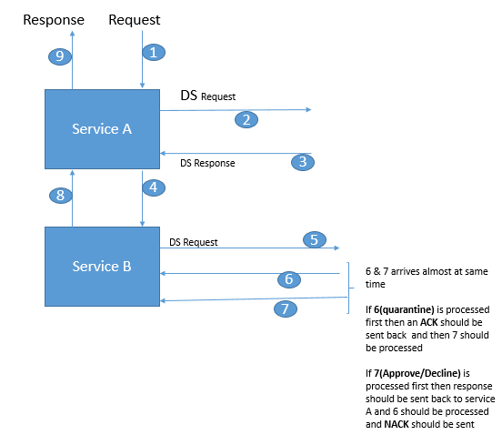

# Uber Cadence Workflow Sample

[Uber Cadence](https://cadenceworkflow.io/) is an [opensource](https://github.com/uber/cadence)  workflow implementation from Uber, based of Amazon's SWF (Simple Workflow).

## More info ##
 - [Cadence: The Only Workflow Platform You'll Ever Need](https://www.youtube.com/watch?v=llmsBGKOuWI)
 - [Cadence Meetup: Introduction to Cadence](https://www.youtube.com/watch?v=-BuIkhlc-RM)
 - [Cadence Meetup: Cadence Architecture](https://www.youtube.com/watch?v=5M5eiNBUf4Q)
 - [Cadence Meetup: Writing a Cadence Workflow](https://www.youtube.com/watch?v=Nbz6XUBKdbM)
 - [Cadence Meetup: Exploring an UberEATS Use Case](https://www.youtube.com/watch?v=-LRghQzfF8k)
 
## Dependency/Uses ##
 - [Uber Cadence](https://github.com/uber/cadence)
 - [Uber Cadence Java Client](https://github.com/uber/cadence-java-client)
 - [Spring Boot 2](https://spring.io/projects/spring-boot)
 - Spring Framework 5
 - [Opentracing](https://opentracing.io/) with [Jaeger](https://www.jaegertracing.io/) as implementation
 - [Micrometer](http://micrometer.io/) with [Prometheus](https://prometheus.io/) as implementation
 - MongoDB
 - Redis Cache
 - Kafka
 - Reactive Programming (reactor-kafka)
 - Gradle build
 - Docker image build using [JIB](https://github.com/GoogleContainerTools/jib)
 - Terraform
 - Deploy to GCP using [helmfile](https://github.com/roboll/helmfile)
 - Deploy to local [k3s](https://k3s.io/) using [helmfile](https://github.com/roboll/helmfile)
 
## Modules/Directory ##
 
 - `infra` Directory contains IaC (Infrastructure as Code) for GCP deployment using helmfile
 - `commons-api` Module contains SB Autoconfiguration for Cadence, Tracer and Metrics
 - `sample-payment-activities-api` Module contains activity API (interface) definition
 - `sample-payment-activities-client` Module contains activity implementation (invoked by cadence to execute workflow)
 - `sample-payment-workflow-api` Module contains workflow API (interface) definition
 - `sample-payment-workflow-client` Module contains workflow implementation (invoked by cadence to execute workflow)
 - `sample-payment-web` Module contains API for submitting workflow request
 
### Sample 2 ###

