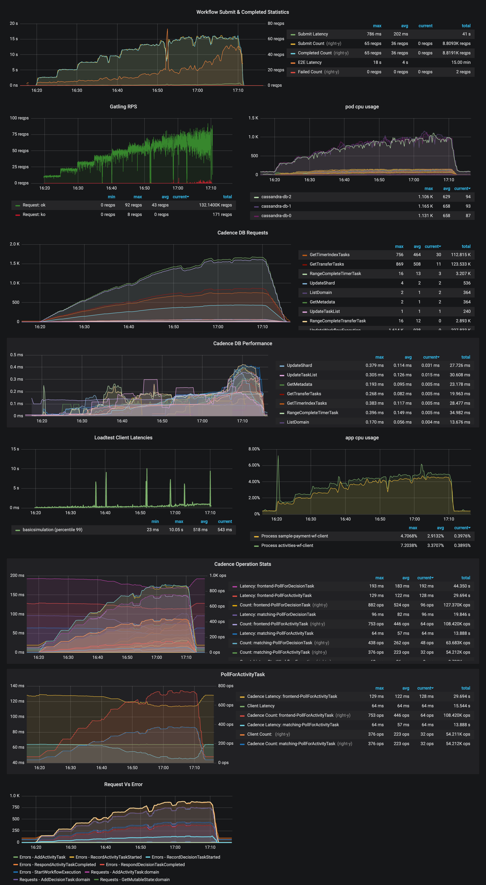

# Load test results #

### Gatling Simulation Configuration ###

```scala
  /* sample payment request */
  private val samplePayment = http("submitPayment")
    .post("/submitPayment")
    .body(bodyTemplate)
    .check(
      status.is(200),
      headerRegex(HttpHeaderNames.ContentType, "application/vnd.wf-res.v1\\+json"),
      jsonPath("$[?(@.workflowId == '${id}')]").exists
    )

  /* sample payment scenario */
  private val scn = scenario("Basic Simulation")
    .exec { session =>
      session
        .set("id", randomUUID.toString)
        .set("rqUID", LocalDateTime.now(ZoneId.of("GMT")).toString)
    }
    .exec(samplePayment)
    .pause(100 milliseconds, 200 milliseconds)

  /* Stop the test when response time is greather than 500 ms or any error occured */
  setUp(
    scn.inject(
      incrementConcurrentUsers(2) // Int
        .times(10)
        .eachLevelLasting(5 minutes)
        .separatedByRampsLasting(5 seconds)
        .startingFrom(2) // Int
    )
  ).protocols(httpProtocol)
```

### GKE Node Configuration ###


## Test 1 ##

#### GKE Workload Configuration ####

```text
NAME                                                     READY   UP-TO-DATE   AVAILABLE   AGE
deployment.extensions/cadence-frontend                   3/3     3            3           96m
deployment.extensions/cadence-history                    6/6     6            6           96m
deployment.extensions/cadence-matching                   3/3     3            3           96m
deployment.extensions/cadence-web                        1/1     1            1           96m
deployment.extensions/cadence-worker                     1/1     1            1           96m
deployment.extensions/gatling                            1/1     1            1           82m
deployment.extensions/grafana                            1/1     1            1           107m
deployment.extensions/influxdb                           1/1     1            1           107m
deployment.extensions/jaeger-collector                   1/1     1            1           106m
deployment.extensions/jaeger-query                       1/1     1            1           106m
deployment.extensions/prometheus-server                  1/1     1            1           108m
deployment.extensions/sample-payment-activities-client   2/2     2            2           94m
deployment.extensions/sample-payment-web                 1/1     1            1           93m
deployment.extensions/sample-payment-workflow-client     4/4     4            4           94m

NAME                                     READY   AGE
statefulset.apps/cassandra-db            3/3     121m
statefulset.apps/cp-kafka                3/3     113m
statefulset.apps/cp-kafka-cp-zookeeper   3/3     113m
statefulset.apps/mongodb-arbiter         1/1     110m
statefulset.apps/mongodb-primary         1/1     110m
statefulset.apps/mongodb-secondary       1/1     110m
statefulset.apps/redis-master            1/1     109m
statefulset.apps/redis-slave             3/3     109m
```

#### Workflow Statistics ####


#### Gatling Report ####
[Gatling Report](./test1/basicsimulation-20191005031646902/index.html)

## Test 2 ##

#### GKE Workload Configuration ####

```text
NAME                                                     READY   UP-TO-DATE   AVAILABLE   AGE
deployment.extensions/cadence-frontend                   3/3     3            3           4h23m
deployment.extensions/cadence-history                    6/6     6            6           4h23m
deployment.extensions/cadence-matching                   3/3     3            3           4h23m
deployment.extensions/cadence-web                        1/1     1            1           4h23m
deployment.extensions/cadence-worker                     1/1     1            1           4h23m
deployment.extensions/gatling                            1/1     1            1           174m
deployment.extensions/grafana                            1/1     1            1           4h27m
deployment.extensions/influxdb                           1/1     1            1           4h27m
deployment.extensions/jaeger-collector                   1/1     1            1           4h26m
deployment.extensions/jaeger-query                       1/1     1            1           4h26m
deployment.extensions/prometheus-server                  1/1     1            1           4h28m
deployment.extensions/sample-payment-activities-client   4/4     4            4           4h22m
deployment.extensions/sample-payment-web                 1/1     1            1           4h21m
deployment.extensions/sample-payment-workflow-client     6/6     6            6           4h22m
NAME                                     READY   AGE
statefulset.apps/cassandra-db            3/3     4h37m
statefulset.apps/cp-kafka                3/3     4h32m
statefulset.apps/cp-kafka-cp-zookeeper   3/3     4h32m
statefulset.apps/mongodb-arbiter         1/1     4h30m
statefulset.apps/mongodb-primary         1/1     4h30m
statefulset.apps/mongodb-secondary       1/1     4h30m
statefulset.apps/redis-master            1/1     4h29m
statefulset.apps/redis-slave             3/3     4h29m
```

#### Workflow Statistics ####


#### Gatling Report ####
[Gatling Report](./test1/basicsimulation-20191005081940420/index.html)
